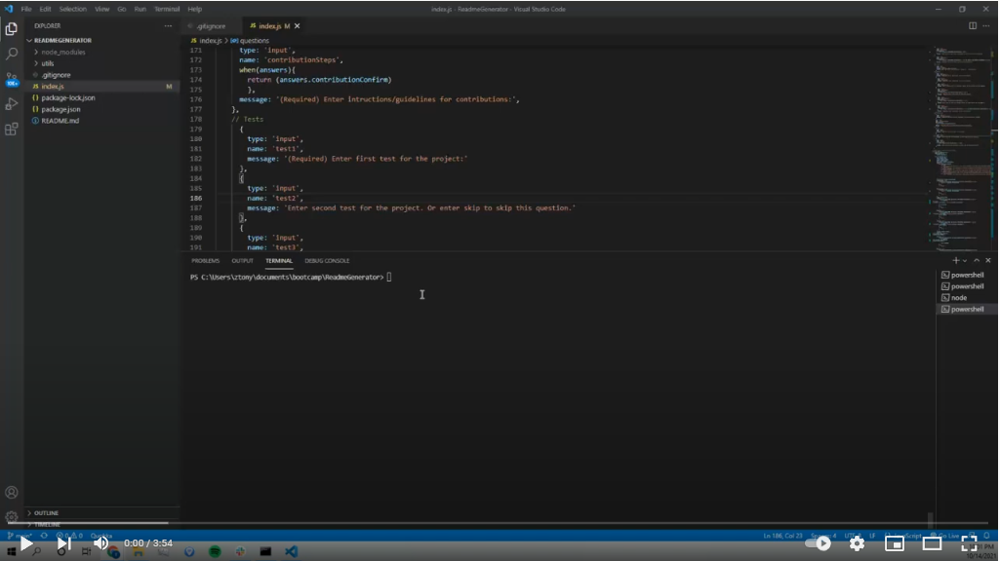

# ReadmeGenerator
The aim of this project is to create a quality readme generator with node.js. The application should be able to takes user inputs in terminal/gitbash, and automatically generate a README.md file for the user's project. The readme file contains sections and information on the developer, licenses, project title and description, installation process, usage description, credits and methods of contributions, and tests. Outside of the requirements for this project, some questions (with answers associated with optional sections of readme) are rendered skippable, and some questions are only asked given certain user responses to provide some flexibility in terms of customization to the user.
​
<br/>

### Prerequisites
​
The application uses node.js. For download and installation procedure, see [Link](https://nodejs.org/en/download/).


<br/>

### Installing

To use the application, the user should open terminal/git bash, locate the ReadmeGenerator folder, perform ```npm install``` to install the required packages (inquirer). After installation completes, user may initiate the application with command ```node index.js```.

<br/>

## Built With

* [Javascript](https://developer.mozilla.org/en-US/docs/Web/Javascript)

​<br/>

## Application Code

View javascript comments.

## Demonstration

See demo.mp4
[](https://youtu.be/12V32XBIDmk)


## Authors

* **Tony Zhang** 
- [Link to Portfolio Site](https://tonyzyt9947.github.io/PersonalPortfolio/)
- [Link to Github](https://github.com/Tonyzyt9947)
- [Link to LinkedIn](https://www.linkedin.com/in/tony-zhang-61670421b/)
​
<br/><br/>

## License
​
This project is licensed under the MIT License 
​
<br/><br/>
## Acknowledgments
* Node.js [Link](https://openweathermap.org/api)
